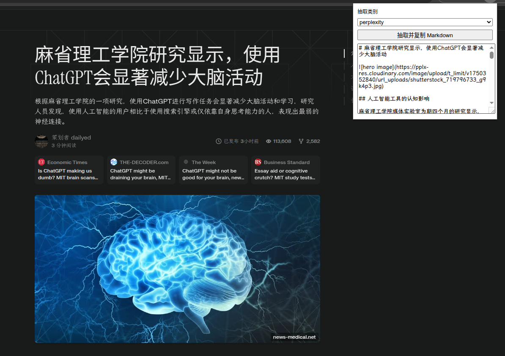
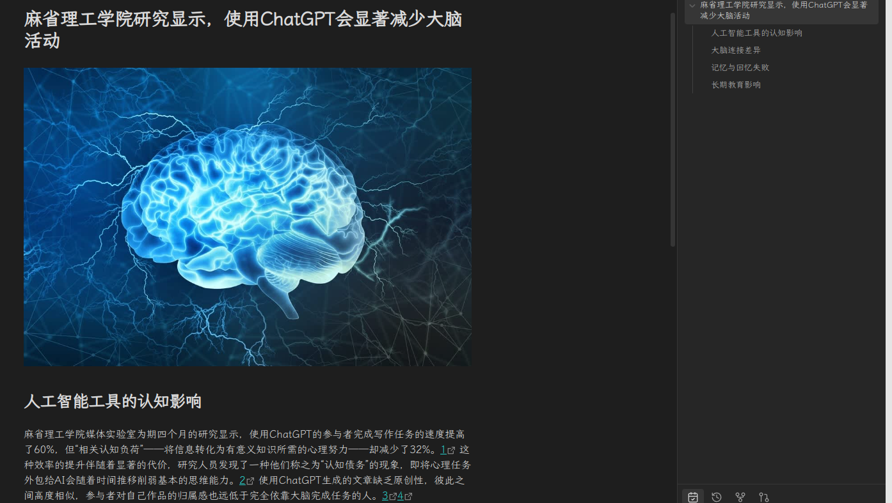

# Perplexity Clipper

> Chrome 扩展：一键提取 Perplexity.ai 文章为干净的 Markdown 格式。支持文章标题、首图、章节结构等完整保留。

## 效果展示

### 原文页面

### 提取效果

## 功能特点

- 🎯 专注于 Perplexity.ai 文章页面
- 📝 提取为干净的 Markdown 格式
- 🖼 保留文章首图
- 📑 保持原文章结构（H1/H2）
- 📋 自动复制到剪贴板
- 💾 可选下载 .md 文件

## 使用方法

1. `git clone … && cd perplexity-clipper`
2. 打开 Chrome 扩展管理页面 `chrome://extensions`
3. 开启「开发者模式」
4. 点击「加载已解压的扩展」
5. 打开任意 Perplexity 文章页面
6. 点击扩展图标，一键提取！

## 开发相关

- 可在 `popup.js` 中取消注释以启用 .md 文件下载功能
- 欢迎提交 Issue 和 PR

## License

MIT License · Made with ❤️ by [SockingPanda](https://github.com/SockingPanda)
